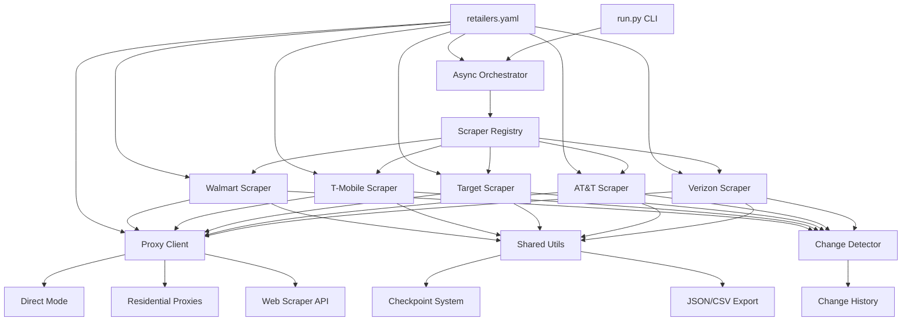
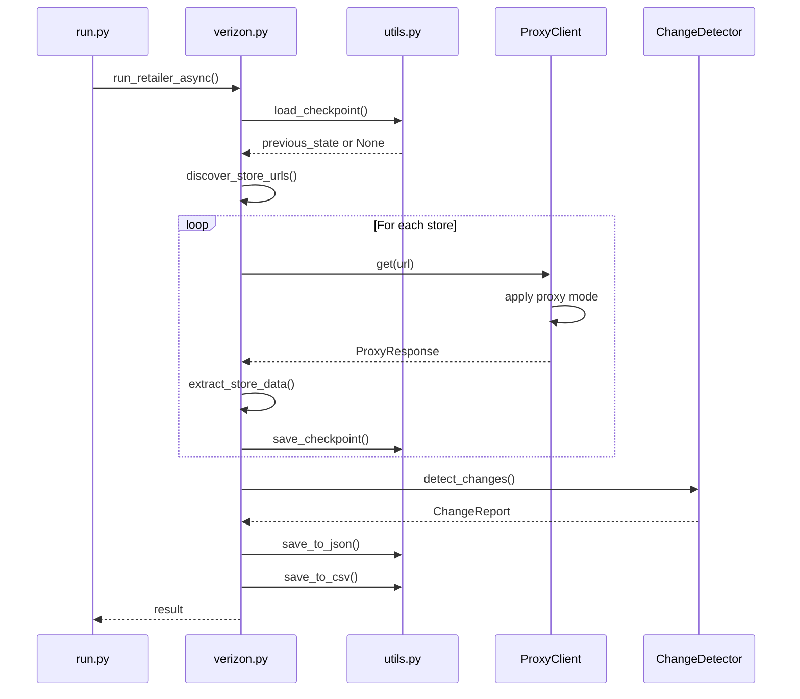
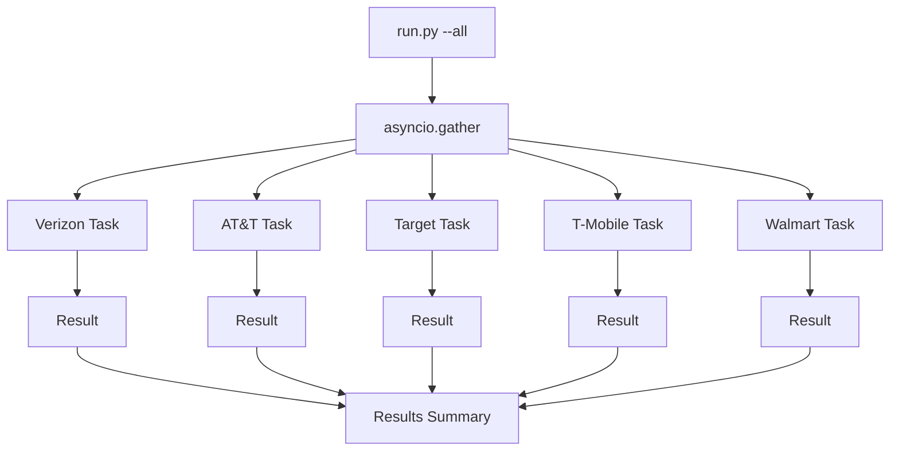
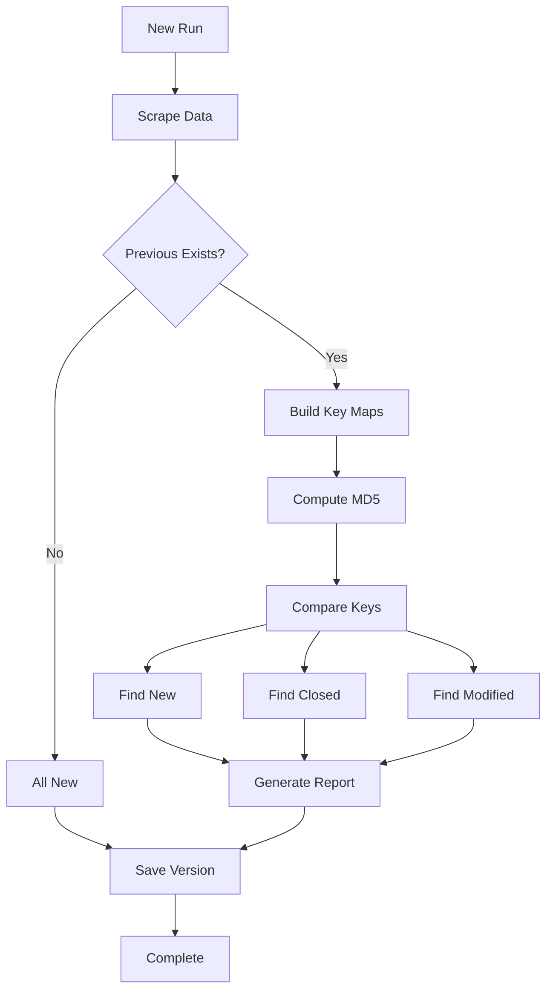

# Multi-Retailer Store Scraper - AI Agent Guide

**Version:** 2.0  
**Last Updated:** January 2026  
**Target Audience:** AI Coding Assistants

---

## Table of Contents

1. [Project Overview](#1-project-overview)
2. [Architecture Deep Dive](#2-architecture-deep-dive)
3. [Development Workflows](#3-development-workflows)
4. [Configuration System](#4-configuration-system)
5. [Extending the Scraper](#5-extending-the-scraper)
6. [Data Management](#6-data-management)
7. [Anti-Blocking and Proxy Integration](#7-anti-blocking-and-proxy-integration)
8. [Testing](#8-testing)
9. [Deployment](#9-deployment)
10. [Troubleshooting Guide](#10-troubleshooting-guide)
11. [Code Patterns and Best Practices](#11-code-patterns-and-best-practices)
12. [Quick Reference](#12-quick-reference)

---

## 1. Project Overview

### Purpose

A production-grade Python web scraper that collects retail store location data from multiple major retailers. Designed for scalability, reliability, and ease of maintenance.

### Supported Retailers

| Retailer | Status | Discovery Method | Store Count |
|----------|--------|------------------|-------------|
| Verizon | ✅ Active | 4-phase HTML crawl | ~2,400 |
| AT&T | ✅ Active | XML Sitemap | ~5,000 |
| Target | ✅ Active | Gzipped Sitemap + API | ~1,900 |
| T-Mobile | ✅ Active | Paginated Sitemaps | ~5,000 |
| Walmart | ✅ Active | Multiple Gzipped Sitemaps | ~4,700 |
| Best Buy | 🚧 WIP | XML Sitemap | ~1,000 |

### Key Features

- **Concurrent Execution**: Run all retailers simultaneously using asyncio
- **Change Detection**: Identify new, closed, and modified stores between runs
- **Checkpoint System**: Resume from interruptions without data loss
- **Anti-Blocking Measures**: User-agent rotation, random delays, rate limit handling
- **Proxy Support**: Oxylabs integration (residential proxies + Web Scraper API)
- **Docker Support**: Containerized deployment with docker-compose
- **Web Dashboard**: Real-time progress monitoring via Flask
- **Systemd Integration**: Persistent service for Linux servers

### Technology Stack

**Core Dependencies:**
```python
requests>=2.31.0          # HTTP client
beautifulsoup4>=4.12.0    # HTML parsing
lxml>=5.0.0               # XML/HTML parser
brotli>=1.1.0             # Brotli decompression (T-Mobile)
aiohttp>=3.9.0            # Async HTTP
pyyaml>=6.0.0             # Configuration
flask>=3.0.0              # Dashboard
pytest>=7.4.0             # Testing
```

**Python Version:** 3.11+

---

## 2. Architecture Deep Dive

### System Architecture



### Component Responsibilities

#### `run.py` - CLI Entry Point
- Argument parsing (retailer selection, modes, proxy config)
- Async orchestration of single/multiple retailers
- Status reporting
- Proxy client initialization
- Error handling and logging setup

**Key Functions:**
- `main()` - Entry point
- `run_retailer_async()` - Execute single retailer
- `run_all_retailers()` - Concurrent execution
- `show_status()` - Display progress

#### `src/scrapers/__init__.py` - Scraper Registry
- Dynamic scraper loading via importlib
- Retailer name to module path mapping
- Available retailer listing

**Registry Pattern:**
```python
SCRAPER_REGISTRY: Dict[str, str] = {
    'verizon': 'src.scrapers.verizon',
    'att': 'src.scrapers.att',
    # ...
}
```

#### `src/scrapers/{retailer}.py` - Retailer Scrapers
Each scraper implements retailer-specific logic:
- URL discovery (sitemap parsing or HTML crawling)
- Store page scraping
- Data extraction and normalization
- Checkpoint management

**Common Patterns:**
- `discover_store_urls()` - Find all store URLs
- `scrape_store()` - Extract data from single store
- `run()` - Main execution function

#### `src/shared/utils.py` - Shared Utilities

**HTTP Functions:**
- `get_with_retry()` - Fetch with exponential backoff
- `get_headers()` - User-agent rotation
- `random_delay()` - Anti-blocking delays

**Checkpoint Functions:**
- `save_checkpoint()` - Atomic write with temp file
- `load_checkpoint()` - Resume from saved state

**Export Functions:**
- `save_to_json()` - JSON export
- `save_to_csv()` - CSV export with fieldname filtering

**Proxy Functions:**
- `get_proxy_client()` - Global proxy client instance
- `init_proxy_from_yaml()` - Load proxy config
- `get_with_proxy()` - Proxy-aware HTTP requests
- `ProxiedSession` - Requests.Session-compatible wrapper

#### `src/shared/proxy_client.py` - Oxylabs Integration

**Classes:**
- `ProxyMode` - Enum: DIRECT, RESIDENTIAL, WEB_SCRAPER_API
- `ProxyConfig` - Configuration dataclass
- `ProxyClient` - Unified proxy interface
- `ProxyResponse` - Unified response object

**Proxy Modes:**
1. **Direct**: Standard requests (no proxy)
2. **Residential**: Oxylabs 175M+ IP pool, rotating IPs
3. **Web Scraper API**: Managed service with JS rendering, CAPTCHA bypass

#### `src/change_detector.py` - Change Detection

**Process:**
1. Load previous run data (`stores_previous.json`)
2. Compare with current run using fingerprints (MD5 hash)
3. Identify new, closed, and modified stores
4. Generate change report with field-level diffs
5. Save to `history/changes_YYYY-MM-DD.json`

**Store Identification:**
- Priority: `store_id` → `url` → address-based key
- Fingerprint includes identity + comparison fields

#### `config/retailers.yaml` - Central Configuration

**Structure:**
```yaml
proxy:
  mode: direct  # or residential, web_scraper_api
  residential:
    endpoint: pr.oxylabs.io:7777
    country_code: us
  web_scraper_api:
    endpoint: https://realtime.oxylabs.io/v1/queries
    render_js: false

defaults:
  min_delay: 2.0
  max_delay: 5.0
  # ...

retailers:
  verizon:
    enabled: true
    base_url: https://www.verizon.com
    min_delay: 2.0
    # ...
```

### Data Flow

```mermaid
flowchart LR
    Start[Start Scraper] --> LoadConfig[Load Config]
    LoadConfig --> InitProxy[Initialize Proxy Client]
    InitProxy --> LoadCheckpoint{Checkpoint Exists?}
    
    LoadCheckpoint -->|Yes| Resume[Resume from Checkpoint]
    LoadCheckpoint -->|No| Discover[Discover Store URLs]
    
    Resume --> ProcessStores[Process Stores]
    Discover --> ProcessStores
    
    ProcessStores --> FetchPage[Fetch Store Page]
    FetchPage --> ExtractData[Extract Store Data]
    ExtractData --> SaveCheckpoint[Save Checkpoint]
    SaveCheckpoint --> MoreStores{More Stores?}
    
    MoreStores -->|Yes| ProcessStores
    MoreStores -->|No| DetectChanges[Detect Changes]
    
    DetectChanges --> SaveResults[Save Results]
    SaveResults --> ExportJSON[Export JSON]
    ExportJSON --> ExportCSV[Export CSV]
    ExportCSV --> SaveHistory[Save Change History]
    SaveHistory --> End[Complete]
```



### Scraper Execution Flow

**Single Retailer:**


**Concurrent Execution:**


---

## 3. Development Workflows

### Common Commands

#### Running Scrapers

```bash
# Single retailer
python run.py --retailer verizon

# All retailers concurrently
python run.py --all

# All except specific retailers
python run.py --all --exclude bestbuy

# With resume from checkpoints
python run.py --all --resume

# Incremental mode (only new/changed stores)
python run.py --retailer target --incremental

# Test mode (10 stores per retailer)
python run.py --all --test

# Limit stores per retailer
python run.py --retailer target --limit 100

# With proxy
python run.py --all --proxy residential
python run.py --retailer walmart --proxy web_scraper_api --render-js

# Verbose logging
python run.py --retailer verizon --verbose
```

#### Status Checking

```bash
# Check all retailers
python run.py --status

# Check specific retailer
python run.py --status --retailer verizon
```

#### Testing

```bash
# Run all tests
pytest tests/

# Run specific test file
pytest tests/test_change_detector.py

# Run with coverage
pytest tests/ --cov=src --cov-report=html

# Run specific test
pytest tests/test_scrapers/test_verizon.py::test_scrape_store
```

#### Linting

```bash
# Lint all Python files (matches CI)
pylint $(git ls-files '*.py')

# Lint specific file
pylint src/scrapers/verizon.py

# Lint with custom config
pylint --rcfile=.pylintrc src/
```

#### Docker

```bash
# Build and run
docker-compose up -d

# Run specific retailer
docker-compose run scraper python run.py --retailer verizon

# View logs
docker-compose logs -f scraper

# Stop services
docker-compose down

# Rebuild after code changes
docker-compose build --no-cache
```

### Development Setup

```bash
# Clone repository
git clone https://github.com/yourusername/retail-store-scraper.git
cd retail-store-scraper

# Create virtual environment
python3.11 -m venv venv
source venv/bin/activate  # On Windows: venv\Scripts\activate

# Install dependencies
pip install -r requirements.txt

# Set up environment variables (optional, for proxies)
cp .env.example .env
# Edit .env with your Oxylabs credentials

# Run first scraper
python run.py --retailer verizon --test
```

---

## 4. Configuration System

### `config/retailers.yaml` Structure

The central configuration file controls all scraper behavior:

#### Global Proxy Settings

```yaml
proxy:
  mode: "direct"  # Options: direct, residential, web_scraper_api
  
  residential:
    endpoint: "pr.oxylabs.io:7777"
    country_code: "us"
    session_type: "rotating"  # or "sticky"
  
  web_scraper_api:
    endpoint: "https://realtime.oxylabs.io/v1/queries"
    render_js: false
    parse: false
  
  timeout: 60
  max_retries: 3
  retry_delay: 2.0
```

#### Default Settings

```yaml
defaults:
  min_delay: 2.0
  max_delay: 5.0
  max_retries: 3
  timeout: 30
  rate_limit_base_wait: 30
  pause_50_requests: 50
  pause_50_min: 30
  pause_50_max: 60
  pause_200_requests: 200
  pause_200_min: 120
  pause_200_max: 180
  checkpoint_interval: 100
```

#### Per-Retailer Configuration

```yaml
retailers:
  verizon:
    name: "Verizon"
    enabled: true
    base_url: "https://www.verizon.com"
    sitemap_urls: []
    discovery_method: "html_crawl"
    min_delay: 2.0
    max_delay: 5.0
    checkpoint_interval: 10
    output_fields:
      - name
      - street_address
      - city
      - state
      - zip
      - country
      - latitude
      - longitude
      - phone
      - url
      - scraped_at
```

### Per-Retailer Python Configs

Located in `config/{retailer}_config.py`:

**Example: `config/verizon_config.py`**
```python
BASE_URL = "https://www.verizon.com"
STORES_BASE = f"{BASE_URL}/stores"

# Delays
MIN_DELAY = 2.0
MAX_DELAY = 5.0

# Checkpointing
CHECKPOINT_DIR = "data/verizon/checkpoints"
CHECKPOINT_INTERVAL = 10

# Output
OUTPUT_DIR = "data/verizon/output"
OUTPUT_FIELDS = [
    'name', 'street_address', 'city', 'state',
    'zip', 'country', 'latitude', 'longitude',
    'phone', 'url', 'scraped_at'
]
```

### Environment Variables

**Proxy Credentials:**
```bash
# Mode-specific credentials (recommended)
export OXYLABS_RESIDENTIAL_USERNAME=your_username
export OXYLABS_RESIDENTIAL_PASSWORD=your_password
export OXYLABS_SCRAPER_API_USERNAME=your_username
export OXYLABS_SCRAPER_API_PASSWORD=your_password

# Legacy/fallback credentials
export OXYLABS_USERNAME=your_username
export OXYLABS_PASSWORD=your_password

# Proxy configuration
export PROXY_MODE=residential  # or direct, web_scraper_api
export OXYLABS_COUNTRY=us
export OXYLABS_RENDER_JS=false
```

**Other Settings:**
```bash
export LOG_LEVEL=INFO
export DATA_DIR=data
```

### Anti-Blocking Configuration

**Request Delays:**
- `min_delay` / `max_delay` - Random delay between requests
- Prevents rate limiting by spreading requests over time

**Pause Thresholds:**
- `pause_50_requests` - Pause after every 50 requests
- `pause_50_min` / `pause_50_max` - Pause duration range
- `pause_200_requests` - Longer pause after 200 requests
- `pause_200_min` / `pause_200_max` - Longer pause duration range

**User-Agent Rotation:**
Defined in `src/shared/utils.py`:
```python
DEFAULT_USER_AGENTS = [
    "Mozilla/5.0 (Macintosh; ...) Chrome/120.0.0.0",
    "Mozilla/5.0 (Macintosh; ...) Safari/605.1.15",
    "Mozilla/5.0 (Macintosh; ...) Firefox/121.0",
    "Mozilla/5.0 (Windows NT ...) Edge/120.0.0.0",
]
```

### Proxy Configuration Patterns

**Per-Retailer Override:**
```yaml
retailers:
  walmart:
    # ... other config ...
    proxy:
      mode: "web_scraper_api"
      render_js: true
```

**CLI Override:**
```bash
python run.py --all --proxy residential --proxy-country us
```

**Priority Order:**
1. CLI arguments (highest)
2. Per-retailer config in retailers.yaml
3. Global proxy config in retailers.yaml
4. Environment variables
5. Default (direct mode)

---

## 5. Extending the Scraper

### Adding a New Retailer - Step by Step

#### Step 1: Create Scraper Module

Create `src/scrapers/newretailer.py` with basic structure:

```python
"""Scraper for NewRetailer stores"""

import logging
from typing import List, Dict, Optional
from datetime import datetime
import requests
from bs4 import BeautifulSoup

from config import newretailer_config as config
from src.shared import utils

def discover_store_urls(session: requests.Session) -> List[str]:
    """Discover all store URLs"""
    sitemap_url = config.SITEMAP_URL
    response = utils.get_with_retry(session, sitemap_url)
    
    if not response:
        return []
    
    soup = BeautifulSoup(response.content, 'lxml-xml')
    urls = [loc.text for loc in soup.find_all('loc')]
    
    logging.info(f"Discovered {len(urls)} store URLs")
    return urls

def scrape_store(session: requests.Session, url: str) -> Optional[Dict]:
    """Scrape single store page"""
    response = utils.get_with_retry(
        session, url,
        min_delay=config.MIN_DELAY,
        max_delay=config.MAX_DELAY
    )
    
    if not response:
        return None
    
    try:
        soup = BeautifulSoup(response.text, 'html.parser')
        
        store_data = {
            'store_id': extract_store_id(soup),
            'name': extract_name(soup),
            'street_address': extract_address(soup),
            'city': extract_city(soup),
            'state': extract_state(soup),
            'zip': extract_zip(soup),
            'phone': extract_phone(soup),
            'latitude': extract_latitude(soup),
            'longitude': extract_longitude(soup),
            'url': url,
            'scraped_at': datetime.now().isoformat()
        }
        
        return store_data
    except Exception as e:
        logging.error(f"Error scraping {url}: {e}")
        return None

def run(resume: bool = False, limit: Optional[int] = None):
    """Main execution function"""
    session = requests.Session()
    
    checkpoint_path = f"{config.CHECKPOINT_DIR}/progress.json"
    checkpoint = utils.load_checkpoint(checkpoint_path) if resume else None
    
    all_urls = discover_store_urls(session)
    
    if checkpoint:
        processed_urls = set(checkpoint.get('processed_urls', []))
        all_urls = [url for url in all_urls if url not in processed_urls]
    
    if limit:
        all_urls = all_urls[:limit]
    
    stores = []
    processed_urls = checkpoint.get('processed_urls', []) if checkpoint else []
    
    for i, url in enumerate(all_urls, 1):
        store = scrape_store(session, url)
        if store:
            stores.append(store)
            processed_urls.append(url)
        
        if i % config.CHECKPOINT_INTERVAL == 0:
            utils.save_checkpoint({
                'processed_urls': processed_urls,
                'stores': stores
            }, checkpoint_path)
    
    utils.save_to_json(stores, f"{config.OUTPUT_DIR}/stores_latest.json")
    utils.save_to_csv(stores, f"{config.OUTPUT_DIR}/stores_latest.csv", 
                      config.OUTPUT_FIELDS)
    
    logging.info(f"Scraped {len(stores)} stores")
    return stores
```

#### Step 2: Create Config File

Create `config/newretailer_config.py`:

```python
"""Configuration for NewRetailer scraper"""

BASE_URL = "https://www.newretailer.com"
SITEMAP_URL = f"{BASE_URL}/stores/sitemap.xml"

MIN_DELAY = 1.0
MAX_DELAY = 2.0
MAX_RETRIES = 3
TIMEOUT = 30

CHECKPOINT_DIR = "data/newretailer/checkpoints"
CHECKPOINT_INTERVAL = 50

OUTPUT_DIR = "data/newretailer/output"
OUTPUT_FIELDS = [
    'store_id', 'name', 'street_address', 'city', 'state',
    'zip', 'country', 'latitude', 'longitude', 'phone',
    'url', 'scraped_at'
]
```

#### Step 3: Register in Scraper Registry

Edit `src/scrapers/__init__.py`:

```python
SCRAPER_REGISTRY: Dict[str, str] = {
    'verizon': 'src.scrapers.verizon',
    'att': 'src.scrapers.att',
    'target': 'src.scrapers.target',
    'tmobile': 'src.scrapers.tmobile',
    'walmart': 'src.scrapers.walmart',
    'bestbuy': 'src.scrapers.bestbuy',
    'newretailer': 'src.scrapers.newretailer',  # Add this line
}
```

#### Step 4: Add to retailers.yaml

```yaml
retailers:
  newretailer:
    name: "NewRetailer"
    enabled: true
    base_url: "https://www.newretailer.com"
    sitemap_urls:
      - "https://www.newretailer.com/stores/sitemap.xml"
    discovery_method: "sitemap"
    min_delay: 1.0
    max_delay: 2.0
    checkpoint_interval: 50
    output_fields:
      - store_id
      - name
      - street_address
      - city
      - state
      - zip
      - country
      - latitude
      - longitude
      - phone
      - url
      - scraped_at
```

#### Step 5: Write Tests

Create `tests/test_scrapers/test_newretailer.py`:

```python
"""Tests for NewRetailer scraper"""

import pytest
from unittest.mock import Mock, patch
from src.scrapers import newretailer

def test_discover_store_urls(mock_session):
    """Test URL discovery"""
    mock_response = Mock()
    mock_response.content = b'''<?xml version="1.0"?>
        <urlset xmlns="http://www.sitemaps.org/schemas/sitemap/0.9">
            <url><loc>https://www.newretailer.com/stores/1</loc></url>
        </urlset>'''
    
    with patch('src.shared.utils.get_with_retry', return_value=mock_response):
        urls = newretailer.discover_store_urls(mock_session)
        assert len(urls) > 0

def test_scrape_store(mock_session):
    """Test store scraping"""
    mock_response = Mock()
    mock_response.text = '<html><div class="store-name">Test Store</div></html>'
    
    with patch('src.shared.utils.get_with_retry', return_value=mock_response):
        store = newretailer.scrape_store(mock_session, 'https://example.com')
        assert store is not None
```

### Scraper Implementation Patterns

#### Pattern 1: Sitemap-Based

```python
def discover_store_urls(session: requests.Session) -> List[str]:
    """Parse XML sitemap"""
    response = utils.get_with_retry(session, SITEMAP_URL)
    soup = BeautifulSoup(response.content, 'lxml-xml')
    return [loc.text for loc in soup.find_all('loc')]
```

#### Pattern 2: Gzipped Sitemap

```python
import gzip
from io import BytesIO

def discover_store_urls(session: requests.Session) -> List[str]:
    """Parse gzipped sitemap"""
    response = utils.get_with_retry(session, SITEMAP_URL)
    
    with gzip.GzipFile(fileobj=BytesIO(response.content)) as f:
        xml_content = f.read()
    
    soup = BeautifulSoup(xml_content, 'lxml-xml')
    return [loc.text for loc in soup.find_all('loc')]
```

#### Pattern 3: Multi-Phase HTML Crawl

```python
def discover_store_urls(session: requests.Session) -> List[str]:
    """Multi-phase: states → cities → stores"""
    states = discover_states(session)
    
    cities = []
    for state in states:
        cities.extend(discover_cities(session, state))
    
    stores = []
    for city in cities:
        stores.extend(discover_stores_in_city(session, city))
    
    return stores
```

---

## 6. Data Management

### Output Directory Structure

```
data/
├── verizon/
│   ├── checkpoints/
│   │   └── progress.json
│   ├── output/
│   │   ├── stores_latest.json
│   │   ├── stores_latest.csv
│   │   └── stores_previous.json
│   ├── history/
│   │   ├── changes_2026-01-15.json
│   │   └── changes_2026-01-10.json
│   └── fingerprints.json
```

### Checkpoint System

**Atomic Write Process:**
1. Write to temporary file
2. Flush and sync to disk
3. Atomic rename to target
4. Guarantees: Complete write or no file

```python
utils.save_checkpoint({
    'processed_urls': processed_urls,
    'stores': stores,
    'current_index': i,
    'timestamp': datetime.now().isoformat()
}, checkpoint_path)
```

### Change Detection Workflow



### Field Naming Conventions

| Field | Type | Example |
|-------|------|---------|
| `store_id` | string | "T-1500" |
| `name` | string | "Target Manhattan" |
| `street_address` | string | "500 5th Ave" |
| `city` | string | "New York" |
| `state` | string | "NY" |
| `zip` | string | "10110" |
| `country` | string | "US" |
| `latitude` | float | 40.7549 |
| `longitude` | float | -73.9840 |
| `phone` | string | "(212) 555-0100" |
| `url` | string | "https://..." |
| `scraped_at` | string | "2026-01-15T10:30:00" |

---

## 7. Anti-Blocking and Proxy Integration

### Built-In Anti-Blocking Strategies

#### Random Delays
```python
utils.random_delay(min_sec=1.0, max_sec=3.0)
```

Recommendations:
- Fast APIs: 0.1-0.5s
- Standard pages: 1.0-3.0s
- Strict sites: 2.0-5.0s

#### User-Agent Rotation
Automatically rotates between Chrome, Safari, Firefox, Edge

#### Pause Thresholds
- After 50 requests: 30-60s pause
- After 200 requests: 2-3min pause

#### Exponential Backoff
For 429 errors: 30s → 60s → 120s

### Oxylabs Proxy Modes

#### Direct Mode
**Use for:** Testing, low-volume scraping  
**Config:**
```yaml
proxy:
  mode: "direct"
```

#### Residential Proxies
**Use for:** Production scraping, geo-targeting  
**Features:** 175M+ rotating IPs, country/city targeting  
**Config:**
```yaml
proxy:
  mode: "residential"
  residential:
    country_code: "us"
```

#### Web Scraper API
**Use for:** JS-heavy sites, CAPTCHA bypass  
**Features:** Managed service, JS rendering, automatic retry  
**Config:**
```yaml
proxy:
  mode: "web_scraper_api"
  web_scraper_api:
    render_js: true
```

### Proxy Configuration Patterns

**Global:**
```yaml
proxy:
  mode: "residential"
```

**Per-Retailer:**
```yaml
retailers:
  walmart:
    proxy:
      mode: "web_scraper_api"
      render_js: true
```

**CLI:**
```bash
python run.py --all --proxy residential --proxy-country us
```

### Rate Limiting Handling

| Code | Action |
|------|--------|
| 200 | Success |
| 429 | Exponential backoff |
| 403 | Log, wait 5min, skip |
| 5xx | Retry with delay |
| 404 | Fail immediately |

---

## 8. Testing

### Running Tests

```bash
# All tests
pytest tests/

# Specific file
pytest tests/test_change_detector.py

# With coverage
pytest tests/ --cov=src --cov-report=html

# Specific test
pytest tests/test_scrapers/test_verizon.py::test_discover_states
```

### Test Structure

```
tests/
├── test_scrapers/
│   ├── test_verizon.py
│   ├── test_att.py
│   └── test_target.py
└── test_shared/
    ├── test_utils.py
    ├── test_proxy_client.py
    └── test_change_detector.py
```

### Writing Tests for New Scrapers

```python
import pytest
from unittest.mock import Mock, patch, MagicMock
from src.scrapers import newretailer

@pytest.fixture
def mock_session():
    """Mock requests session"""
    session = MagicMock()
    return session

def test_discover_store_urls(mock_session):
    """Test URL discovery"""
    mock_response = Mock()
    mock_response.content = b'''<urlset>...</urlset>'''
    
    with patch('src.shared.utils.get_with_retry', return_value=mock_response):
        urls = newretailer.discover_store_urls(mock_session)
        assert isinstance(urls, list)
        assert len(urls) > 0

def test_scrape_store_success(mock_session):
    """Test successful store scraping"""
    mock_response = Mock()
    mock_response.text = '<html>...</html>'
    
    with patch('src.shared.utils.get_with_retry', return_value=mock_response):
        store = newretailer.scrape_store(mock_session, 'https://test.com/store/1')
        
        assert store is not None
        assert 'name' in store
        assert 'scraped_at' in store

def test_scrape_store_failure(mock_session):
    """Test handling of failed requests"""
    with patch('src.shared.utils.get_with_retry', return_value=None):
        store = newretailer.scrape_store(mock_session, 'https://test.com/store/1')
        assert store is None
```

### Mocking HTTP Requests

```python
from unittest.mock import Mock, patch

# Mock successful response
mock_response = Mock()
mock_response.status_code = 200
mock_response.text = '<html>content</html>'
mock_response.content = b'<html>content</html>'

with patch('requests.Session.get', return_value=mock_response):
    # Test code here
    pass

# Mock failed response
mock_response.status_code = 404

# Mock exception
with patch('requests.Session.get', side_effect=requests.exceptions.Timeout):
    # Test timeout handling
    pass
```

---

## 9. Deployment

### Docker Deployment

```bash
# Build and start
docker-compose up -d

# Run specific retailer
docker-compose run scraper python run.py --retailer verizon

# View logs
docker-compose logs -f scraper

# With proxies
OXYLABS_USERNAME=user OXYLABS_PASSWORD=pass \
  docker-compose run scraper python run.py --all --proxy residential
```

**Dockerfile highlights:**
- Based on Python 3.11
- Installs dependencies from requirements.txt
- Sets up data/ directory as volume
- Runs as non-root user

### Linux Server Deployment

```bash
# Run install script
sudo ./deploy/install.sh

# Start service
sudo systemctl start retail-scraper
sudo systemctl enable retail-scraper

# Check status
sudo systemctl status retail-scraper

# View logs
sudo journalctl -u retail-scraper -f

# Check scraper progress
ssh user@server "cd /opt/retail-store-scraper && ./venv/bin/python run.py --status"
```

**Systemd service features:**
- Auto-restart on failure
- Runs as dedicated user
- Logs to journald
- Environment variable support

### Environment Variables

Create `.env` file:
```bash
# Proxy credentials
OXYLABS_RESIDENTIAL_USERNAME=your_username
OXYLABS_RESIDENTIAL_PASSWORD=your_password
OXYLABS_SCRAPER_API_USERNAME=your_username
OXYLABS_SCRAPER_API_PASSWORD=your_password

# Configuration
PROXY_MODE=residential
OXYLABS_COUNTRY=us
LOG_LEVEL=INFO
```

### Monitoring Dashboard

```bash
# Start dashboard
cd dashboard
python app.py

# Access at http://localhost:5000
```

Features:
- Real-time progress for each retailer
- Store counts
- Checkpoint status
- Last run timestamp

---

## 10. Troubleshooting Guide

### Common Issues

#### Issue: 429 Rate Limited

**Symptoms:**
- HTTP 429 responses
- "Rate limited" in logs

**Solutions:**
1. Increase delays: `min_delay: 3.0`, `max_delay: 6.0`
2. Enable proxies: `--proxy residential`
3. Reduce concurrency
4. Add longer pauses

**Example fix:**
```yaml
retailers:
  problematic_site:
    min_delay: 5.0
    max_delay: 10.0
    pause_50_min: 60
    pause_50_max: 120
```

#### Issue: 403 Blocked

**Symptoms:**
- HTTP 403 Forbidden
- All requests blocked after some success

**Solutions:**
1. **Use proxies (best solution):**
   ```bash
   python run.py --retailer verizon --proxy residential
   ```

2. **Rotate user agents more aggressively**

3. **Add longer delays between requests**

4. **Wait 24 hours for IP unblock**

5. **For JS-heavy sites:**
   ```bash
   python run.py --retailer walmart --proxy web_scraper_api --render-js
   ```

#### Issue: 5xx Server Errors

**Symptoms:**
- HTTP 500, 502, 503, 504 responses
- Intermittent failures

**Solutions:**
1. Retry logic (built-in)
2. Reduce request rate
3. Check site status
4. Try different time of day

#### Issue: Checkpoint Corruption

**Symptoms:**
- JSON decode error when loading checkpoint
- Cannot resume

**Solutions:**
1. Delete corrupted checkpoint:
   ```bash
   rm data/retailer/checkpoints/progress.json
   ```

2. Start fresh (data not lost if output files exist)

3. Review checkpoint interval configuration

**Note:** Atomic writes should prevent this, but file system issues can occur

#### Issue: Missing Data Fields

**Symptoms:**
- Expected fields missing from output
- Parsing errors

**Solutions:**
1. **Check HTML structure:**
   ```bash
   curl -H "User-Agent: Mozilla/5.0..." https://store-url > page.html
   ```

2. **Update selectors in scraper code**

3. **Check if site changed structure**

4. **Enable verbose logging:**
   ```bash
   python run.py --retailer target --verbose
   ```

5. **Test single store:**
   ```bash
   python run.py --retailer target --limit 1 --verbose
   ```

#### Issue: Out of Memory

**Symptoms:**
- Python process killed
- MemoryError

**Solutions:**
1. **Reduce checkpoint interval** (don't store all data in memory)

2. **Process in batches:**
   ```python
   # Instead of storing all stores
   stores = []  # Don't do this for 10,000+ stores
   
   # Stream to file periodically
   if len(stores) >= 1000:
       save_batch(stores)
       stores = []
   ```

3. **Increase system memory or use swap**

#### Issue: Slow Performance

**Symptoms:**
- Taking much longer than expected
- Single-threaded bottleneck

**Solutions:**
1. **Use proxies to remove delays:**
   ```bash
   python run.py --all --proxy residential
   ```

2. **Run retailers concurrently:**
   ```bash
   python run.py --all  # Instead of one at a time
   ```

3. **Reduce delays for APIs:**
   ```yaml
   target:
     min_delay: 0.1
     max_delay: 0.3
   ```

4. **Check network latency**

### Debugging Strategies

#### Enable Verbose Logging

```bash
python run.py --retailer verizon --verbose
```

Logs include:
- Each request URL
- Response status codes
- Delays applied
- Checkpoint saves
- Error details

#### Test Single Store

```bash
python run.py --retailer verizon --limit 1 --verbose
```

Isolates issues to specific store or general problem

#### Check Logs

```bash
# View recent logs
tail -f logs/scraper.log

# Search for errors
grep ERROR logs/scraper.log

# Search for specific retailer
grep "verizon" logs/scraper.log
```

#### Inspect Output Files

```bash
# Check JSON structure
jq '.[0]' data/verizon/output/stores_latest.json

# Count stores
jq 'length' data/verizon/output/stores_latest.json

# Find stores with missing fields
jq '.[] | select(.phone == null or .phone == "")' data/verizon/output/stores_latest.json
```

#### Test HTTP Requests Manually

```bash
# Test URL accessibility
curl -I "https://www.verizon.com/stores/california"

# Test with user agent
curl -H "User-Agent: Mozilla/5.0 (Macintosh; Intel Mac OS X 10_15_7)" \
     "https://www.verizon.com/stores/california"

# Save response for inspection
curl "https://www.verizon.com/stores/california" > response.html
```

### When to Use Proxies

**Always use proxies when:**
- Running in production
- Scraping > 1,000 pages
- Site has Cloudflare or similar protection
- Getting 403/429 errors
- Need geo-targeting

**Can skip proxies when:**
- Testing/development
- Site has public API
- Scraping < 100 pages
- Site explicitly allows scraping

**Proxy mode recommendations by retailer:**
- Verizon: residential (many pages)
- AT&T: direct ok (simple sitemap)
- Target: direct ok (API-based)
- T-Mobile: residential (moderate volume)
- Walmart: web_scraper_api (JS-heavy)
- Best Buy: web_scraper_api (strong anti-bot)

---

## 11. Code Patterns and Best Practices

### HTTP Requests

**Always use `get_with_retry()`:**

```python
# Good
response = utils.get_with_retry(
    session, url,
    min_delay=config.MIN_DELAY,
    max_delay=config.MAX_DELAY
)

if not response:
    logging.error(f"Failed to fetch {url}")
    return None

# Bad - no retry logic
response = session.get(url)
```

**With proxy support:**

```python
# Automatically uses configured proxy
session = utils.create_proxied_session()
response = session.get(url)
```

### Checkpoint Management

**Save checkpoints at intervals:**

```python
for i, item in enumerate(items, 1):
    process_item(item)
    
    # Save every N items
    if i % CHECKPOINT_INTERVAL == 0:
        utils.save_checkpoint({
            'processed': processed_items,
            'index': i,
            'timestamp': datetime.now().isoformat()
        }, checkpoint_path)
        
        logging.info(f"Checkpoint saved: {i}/{len(items)}")
```

**Load and resume:**

```python
checkpoint = utils.load_checkpoint(checkpoint_path) if resume else None

if checkpoint:
    processed_items = checkpoint.get('processed', [])
    start_index = checkpoint.get('index', 0)
    logging.info(f"Resuming from index {start_index}")
else:
    processed_items = []
    start_index = 0
```

### Error Handling

**Graceful degradation:**

```python
def scrape_store(session, url):
    """Scrape store, return None on failure"""
    try:
        response = utils.get_with_retry(session, url)
        
        if not response:
            return None
        
        soup = BeautifulSoup(response.text, 'html.parser')
        
        # Extract required fields
        store = {
            'name': extract_name(soup),  # May raise exception
            'address': extract_address(soup),
            # ...
        }
        
        return store
        
    except AttributeError as e:
        logging.error(f"Parsing error for {url}: {e}")
        return None
    except Exception as e:
        logging.error(f"Unexpected error for {url}: {e}")
        return None

# In main loop
for url in urls:
    store = scrape_store(session, url)
    if store:  # Skip failures, continue processing
        stores.append(store)
```

### Logging Best Practices

```python
import logging

# At module level
logging.info(f"Starting scrape for {retailer}")
logging.debug(f"Fetching URL: {url}")
logging.warning(f"Rate limited, waiting {wait_time}s")
logging.error(f"Failed to parse store at {url}: {error}")

# Progress updates
logging.info(f"Progress: {i}/{total} ({i/total*100:.1f}%)")

# Summary at end
logging.info(f"Completed: {len(stores)} stores scraped")
```

### Configuration Access

**Load config at module level:**

```python
# In scraper file
from config import verizon_config as config

# Use throughout
MIN_DELAY = config.MIN_DELAY
OUTPUT_DIR = config.OUTPUT_DIR
```

**Per-retailer overrides:**

```python
import yaml

with open('config/retailers.yaml') as f:
    retailers_config = yaml.safe_load(f)

retailer_config = retailers_config['retailers']['verizon']
min_delay = retailer_config.get('min_delay', DEFAULT_MIN_DELAY)
```

### Session Management

**Reuse sessions:**

```python
def run():
    # Create session once
    session = requests.Session()
    session.headers.update(utils.get_headers())
    
    # Reuse for all requests
    for url in urls:
        response = session.get(url)
    
    # Clean up
    session.close()
```

**With context manager:**

```python
with requests.Session() as session:
    session.headers.update(utils.get_headers())
    
    for url in urls:
        response = session.get(url)
```

### Data Validation

```python
def validate_store(store: Dict) -> bool:
    """Validate required fields"""
    required_fields = ['name', 'street_address', 'city', 'state']
    
    for field in required_fields:
        if not store.get(field):
            logging.warning(f"Missing required field: {field}")
            return False
    
    # Validate coordinates
    lat = store.get('latitude')
    lon = store.get('longitude')
    
    if lat and not (-90 <= lat <= 90):
        logging.warning(f"Invalid latitude: {lat}")
        return False
    
    if lon and not (-180 <= lon <= 180):
        logging.warning(f"Invalid longitude: {lon}")
        return False
    
    return True

# Use in main loop
for url in urls:
    store = scrape_store(session, url)
    if store and validate_store(store):
        stores.append(store)
```

---

## 12. Quick Reference

### File Locations

| Path | Purpose |
|------|---------|
| `run.py` | Main CLI entry point |
| `src/scrapers/{retailer}.py` | Retailer scraper implementation |
| `config/retailers.yaml` | Central configuration |
| `config/{retailer}_config.py` | Per-retailer Python config |
| `data/{retailer}/output/` | JSON/CSV output files |
| `data/{retailer}/checkpoints/` | Resume checkpoints |
| `data/{retailer}/history/` | Change detection reports |
| `logs/scraper.log` | Application logs |
| `tests/test_scrapers/` | Scraper tests |
| `dashboard/app.py` | Flask monitoring dashboard |

### CLI Command Examples

```bash
# Single retailer
python run.py --retailer verizon

# All retailers
python run.py --all

# Test mode (10 stores)
python run.py --all --test

# Resume from checkpoint
python run.py --retailer verizon --resume

# With limit
python run.py --retailer target --limit 100

# Status check
python run.py --status

# With proxies
python run.py --all --proxy residential
python run.py --retailer walmart --proxy web_scraper_api --render-js

# Verbose logging
python run.py --retailer verizon --verbose
```

### Common Code Snippets

**Basic scraper structure:**
```python
def discover_store_urls(session):
    # Return list of URLs
    pass

def scrape_store(session, url):
    # Return store dict or None
    pass

def run(resume=False, limit=None):
    session = requests.Session()
    urls = discover_store_urls(session)
    
    stores = []
    for url in urls[:limit] if limit else urls:
        store = scrape_store(session, url)
        if store:
            stores.append(store)
    
    utils.save_to_json(stores, "output.json")
    return stores
```

**HTTP request with retry:**
```python
response = utils.get_with_retry(
    session, url,
    min_delay=1.0,
    max_delay=2.0,
    max_retries=3
)

if response and response.status_code == 200:
    soup = BeautifulSoup(response.text, 'html.parser')
```

**Checkpoint save/load:**
```python
# Save
utils.save_checkpoint({
    'data': my_data,
    'index': current_index
}, 'checkpoints/progress.json')

# Load
checkpoint = utils.load_checkpoint('checkpoints/progress.json')
if checkpoint:
    my_data = checkpoint['data']
```

### Environment Variables

```bash
# Proxy credentials
OXYLABS_RESIDENTIAL_USERNAME=username
OXYLABS_RESIDENTIAL_PASSWORD=password
OXYLABS_SCRAPER_API_USERNAME=username
OXYLABS_SCRAPER_API_PASSWORD=password

# Legacy fallback
OXYLABS_USERNAME=username
OXYLABS_PASSWORD=password

# Proxy settings
PROXY_MODE=residential  # direct, residential, web_scraper_api
OXYLABS_COUNTRY=us
OXYLABS_RENDER_JS=false

# Other
LOG_LEVEL=INFO
DATA_DIR=data
```

### Retailer-Specific Notes

**Verizon:**
- 4-phase HTML crawl (states → cities → stores)
- ~2,400 stores
- Use delays: 2-5 seconds
- Checkpoint every 10 stores

**AT&T:**
- Single XML sitemap
- ~5,000 stores
- Fast scraping possible (0.5-1s delays)
- Checkpoint every 100 stores

**Target:**
- Gzipped sitemap + API
- ~1,900 stores
- API very fast (0.1-0.5s delays)
- Most reliable

**T-Mobile:**
- Multiple paginated sitemaps
- ~5,000 stores
- Requires Brotli decompression
- Standard delays

**Walmart:**
- 4 gzipped sitemaps (supercenter, discount, neighborhood, other)
- ~4,700 stores
- JS-heavy (__NEXT_DATA__)
- Recommend web_scraper_api proxy with render_js

**Best Buy:**
- Currently WIP (disabled)
- Strong anti-bot measures
- Requires web_scraper_api proxy
- ~1,000 stores

---

## Conclusion

This guide provides comprehensive coverage of the retail store scraper architecture, development workflows, and best practices. For questions or issues not covered here, refer to:

- Source code comments and docstrings
- Test files for usage examples
- GitHub issues for known problems
- Oxylabs documentation for proxy features

**Key Takeaways:**
1. Use `get_with_retry()` for all HTTP requests
2. Save checkpoints regularly
3. Use proxies for production scraping
4. Follow established patterns when adding retailers
5. Write tests for new code
6. Monitor logs for issues

---

*Generated for AI coding assistants working with the retail-store-scraper project*

